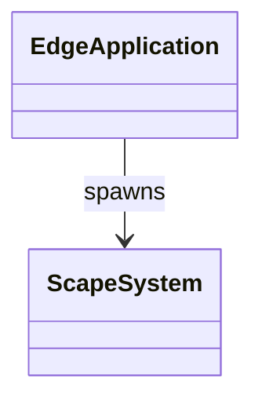
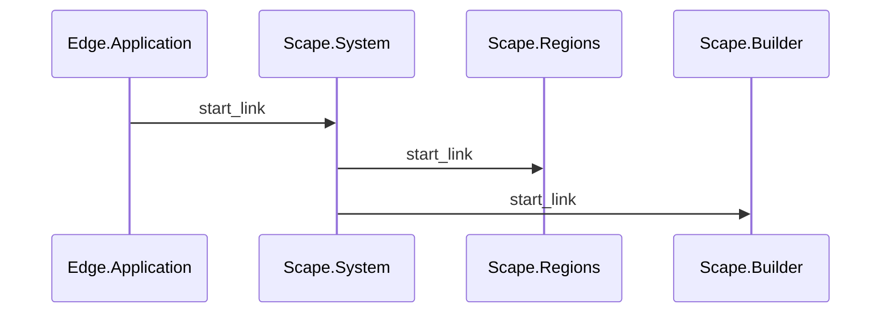

# Scape System

## Description

**Scape.System** is and Edge.Application subsystem that is responsible for managing the regions in the scape.

## Diagrams

## Class Diagram

```mermaid
classDiagram
  class EdgeApplication {    
  }
  class ScapeSystem {
  }

  EdgeApplication --> ScapeSystem: spawns


```

### Sequence Diagram

```mermaid
sequenceDiagram
    participant Edge.Application
    participant Scape.System
    participant Scape.Regions
    participant Scape.Builder
    Edge.Application->>Scape.System: start_link
    Scape.System->>Scape.Regions: start_link
    Scape.System->>Scape.Builder: start_link    
```