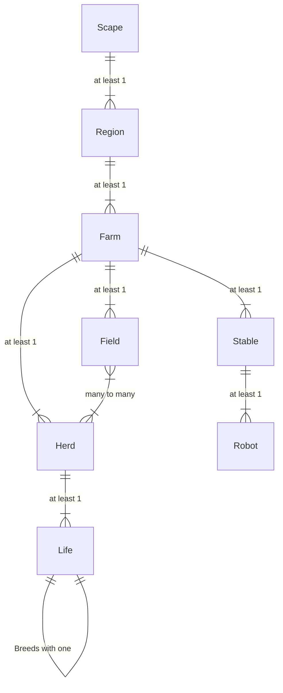

# Swai.Schema

## Outline

- [Swai.Schema](#swaischema)
  - [Outline](#outline)
  - [Domain Model](#domain-model)

## Domain Model

```mermaid
erDiagram 

    Scape ||--|{ Region : "at least 1"
    Region ||--|{ Farm : "at least 1"
    Farm ||--|{ Herd : "at least 1"
    Herd ||--|{ Life : "at least 1"
    Farm ||--|{ Field : "at least 1"
    Life ||--o{ Life : "0 or more"
    Life ||--|| Life : "Breeds with one"
    Field }|--|{ Herd : "many to many"
    Farm ||--|{ Stable : "at least 1"
    Stable ||--|{ Robot : "at least 1" 


```