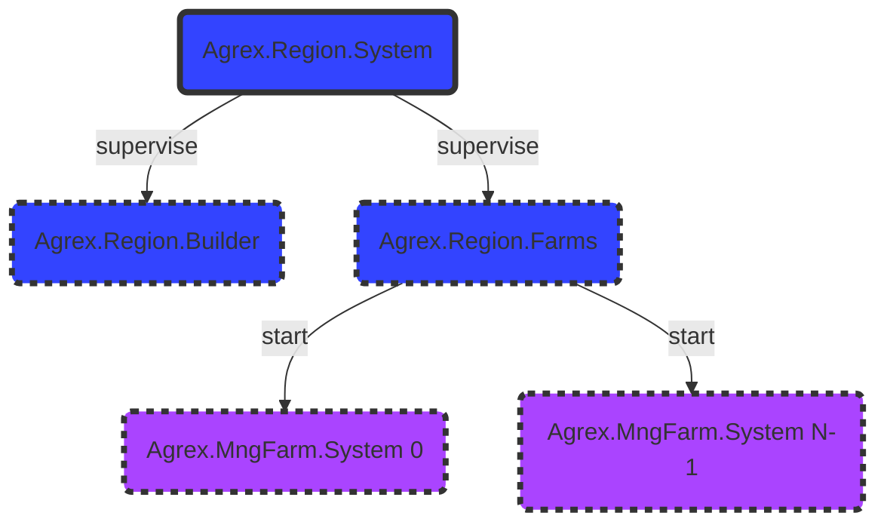

# Agrex.Region Subsystem

## Abstract

The Agrex.Region Subsystem is responsible for generating a virtual region in the Agrex Scape.

A Agrex.Region is identified by an *InitParams.id* and consists of a number of farms, determined by the *InitParams.nbr_of_farms* value.

## **Diagrams**

### Components

### Sequence
